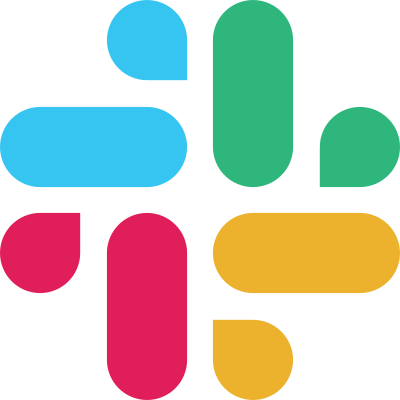

class: clear, title-slide, inverse, center, top, middle

```{r setup, include=FALSE}
knitr::opts_chunk$set(echo = FALSE)
```

```{r, echo=FALSE}
# then load all the relevant packages
pacman::p_load(pacman, knitr, tidyverse, xaringan, xaringanExtra)
```

```{r xaringan-panelset, echo=FALSE}
xaringanExtra::use_panelset()
```

```{r xaringanExtra-clipboard, echo=FALSE}
# these allow any code snippets to be copied to the clipboard so they 
# can be pasted easily
htmltools::tagList(
  xaringanExtra::use_clipboard(
    button_text = "<i class=\"fa fa-clipboard\"></i>",
    success_text = "<i class=\"fa fa-check\" style=\"color: #90BE6D\"></i>",
  ),
  rmarkdown::html_dependency_font_awesome()
)
```
```{r xaringan-extras, echo=FALSE}
xaringanExtra::use_tile_view()

```

# `r rmarkdown::metadata$title`
## `r rmarkdown::metadata$subtitle`
### `r rmarkdown::metadata$author`
### `r rmarkdown::metadata$date`

<br>
### .font100[Welcome Slides: [go.ncsu.edu/laser-welcome](https://go.ncsu.edu/laser-welcome)]
### .font100[Welcome Packet: [go.ncsu.edu/laser-packet](https://go.ncsu.edu/laser-packet)]


---
# Fall Actvities

.panelset[

.panel[.panel-name[Learning Labs & Office Hours]

.pull-left[
Late August through early December we'll offer:
- **Virtual Learning Labs** for TM, ML, SNA, and FS 
- **Office Hours** for open-ended discussion and support 

]

.pull-right[

]
]

.panel[.panel-name[SHARK Goals Check-Ins]

.pull-left[

Starting last August we'll be facilitating asynchronous: 
- **monthly check-ins** to share progress toward your SHARK Goal.
- **#shark-goals channel** on Slack to ask questions and discuss your goals
]

.pull-right[

]

]


.panel[.panel-name[Slack Community]

.pull-left[

Starting last August we'll be facilitating asynchronous: 
- **monthly check-ins** to share progress toward your SHARK Goal.
- **#shark-goals channel** on Slack to ask questions and discuss your goals
]

.pull-right[

]

]

]

---
# LASER Institute Goals

.panelset[


.panel[.panel-name[This Year]

1. **Disciplinary Knowledge**: Deepen understanding of LA methodologies, literature, applications and ethical issues as they relate to STEM education and equity.

2. **Technical Skills:** Develop proficiency with R, Posit Cloud, and other tools for reproducible and collaborative data-intensive research.

3. **Social Capital:** Expand their professional networks, connecting with researchers and experts in LA related fields, as well as other scholars focused on STEM education.

]

.panel[.panel-name[This Week]

1. **Have fun.** Learning new methods can be rewarding but hard, especially when coding is involved, but we want to you enjoy yourselves this week.  
2. **Make Connections** We have an amazing groups of scholars participating this year, use this opportunity to get to know them better. 
3. **Develop a plan.** You won't become an expert in LA overnight, but we want to you leave Friday with a plan to continue learning and apply it to your research. 
4. **Earn two badges.** You'll be exposed to many new concepts and techniques this week, we want you to dig in and demonstrate what you've learned. 
5. **Provide Feedback.** We've revamped our curriculum and need your input to figure out what works well and how we can improve. 

]

.panel[.panel-name[Today]

1. **Community Building (9:15)** - Affinity groups, badges and SHARK goals, oh my!
1. **Learning Lab Intros (10:00)** - Learn about reproducible research and the data-intensive research workflow in our LASER Learning Lab orientation.
1. **Lunch (12:30)** - Eat some great food, connect with new colleagues. 
1. **Scholar TA Panel (1:30)** - Meet three of our past scholars who'll be assisting  throughout the week and learn about their LA journey.            
1. **Method Overviews (2:15)** - Learn about our four concentration areas (FS, ML, TM, and SNA) and accompanying labs and select a learning path this week.
1. **Field Trip (4:30)** - Ice cream party at NC State's dairy farm!
]

]

---
class: clear, center

## .font130[.center[**Thank you!**]]


.center[<br/>**Shaun Kellogg**<br/><mailto:sbkellog@ncsu.edu>]

.pull-left-narrow[.center[ ]]

.pull-right-wide[
.left[.font70[

This work was supported by the National Science Foundation grant DRL-2025090 (ECR:BCSER). Any opinions, findings, and conclusions expressed in this material are those of the authors and do not necessarily reflect the views of the National Science Foundation.
]]
]