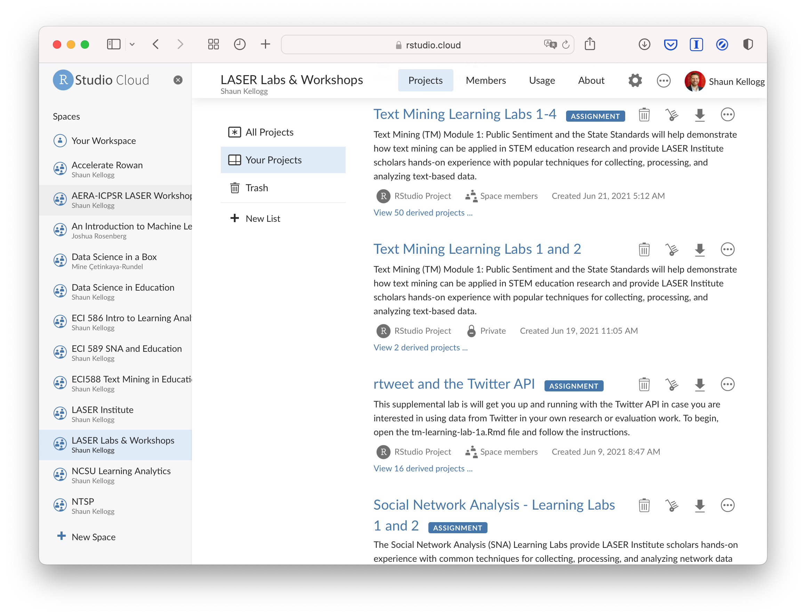
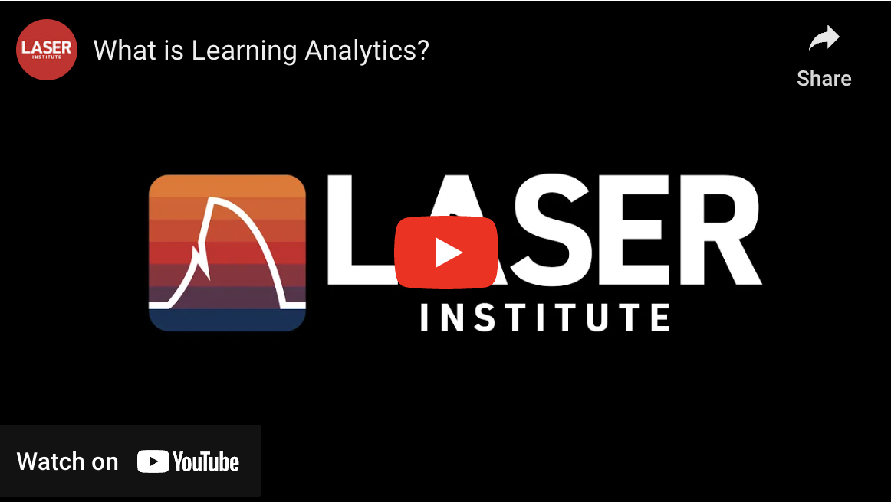

class: clear, title-slide, inverse, center, top, middle

```{r setup, include=FALSE}
knitr::opts_chunk$set(echo = FALSE)
```

```{r, echo=FALSE}
# then load all the relevant packages
pacman::p_load(pacman, knitr, tidyverse, xaringan, xaringanExtra)
```

```{r xaringan-panelset, echo=FALSE}
xaringanExtra::use_panelset()
```

```{r xaringanExtra-clipboard, echo=FALSE}
# these allow any code snippets to be copied to the clipboard so they 
# can be pasted easily
htmltools::tagList(
  xaringanExtra::use_clipboard(
    button_text = "<i class=\"fa fa-clipboard\"></i>",
    success_text = "<i class=\"fa fa-check\" style=\"color: #90BE6D\"></i>",
  ),
  rmarkdown::html_dependency_font_awesome()
)
```
```{r xaringan-extras, echo=FALSE}
xaringanExtra::use_tile_view()

```

# `r rmarkdown::metadata$title`
## `r rmarkdown::metadata$subtitle`
### `r rmarkdown::metadata$author`
### `r format(Sys.time(), "%B %d, %Y")`

<br>
### .font100[[go.ncsu.edu/laser-schedule](go.ncsu.edu/laser-schedule)]

---
# Agenda

<br>

## 1. Welcome to the Friday Institute!

## 2. Meet the LASER Team

## 3. LASER Institute Core Components

## 4. Goals for the Year, the Week, and Today


---
# The Friday Institute for Educational Innovation

At The Friday Institute, **our mission is to advance K-12 education through innovation** in teaching, learning and leadership so that ALL students are prepared to succeed in a rapidly changing world.

- **Educate.** We conduct professional learning, research and evaluation.
- **Innovate.** We design supports, tools and structures for educational change.
- **Inspire.** We convene and collaborate with partners in education, government and private industries to inform standards, policy and practice.

The LASER Institute is a prime example of how we [Think and Do](https://www.ncsu.edu/think-and-do/) at the Friday Institute and we hope that you will carry this mission and vision forward! 

---
class: clear, middle, center


---
# LASER Institute Components

.panelset[

.panel[.panel-name[Learning Labs]

.pull-left[
Each topic (FS, TM, ML, and SNA) consist of four progressively sequenced labs that include:
- A Presentation & Code-Along
- Essential Readings
- Coding Case Study or R Primers
- LASER Badge

]

.pull-right[

]
]


.panel[.panel-name[Guest Speakers]

.pull-left[
Authors of the recently updated [Handbook of Learning Analytics](https://www.solaresearch.org/publications/hla-22/): 
- What is learning analytics?
- LA for Supporting Collaboration
- Data Literacy and Learning Analytics
- LA and Learning at Scale
- Fairness, Bias, and Equity in LA

]

.pull-right[

.font80[.center[[2021 LASER Keynote](https://youtu.be/gKM3T_CzC10)]]
]


]

.panel[.panel-name[Community]
We've partnered with [Participate, Inc.](https://www.participate.com) to help us: 
- develop in-person and online **community-building activities**
- organize **affinity groups** for collaborative research 
- structure monthly **progress updates** with scholars
- facilitate online **discussions forums** 
]


.panel[.panel-name[Planning & Research]

Time and support is provided for scholars to develop a professional learning plan and work with your own data to further research goals.

> *I am thrilled to share with you all about a recently funded project that was influenced by my participation in LASER.  I hope also to continue growing collaborations that have emerged out of this community!* 

.pull.right[2021 LASER Scholar]

]

]

---
# LASER Institute Goals

.panelset[


.panel[.panel-name[This Year]

1. **Disciplinary Knowledge**: Deepen understanding of LA methodologies, literature, applications and ethical issues as they relate to STEM education and equity.

2. **Technical Skills:** Develop proficiency with R,  GitHub and other tools for collaboration, reproducible research and computational analysis.

3. **Social Capital:** Expand their professional networks, connecting with researchers and experts in LA related fields, as well as other scholars focused on STEM education.

]

.panel[.panel-name[This Week]

1. **Have fun.**

2. **Make some friends.** 

3. **Make a plan.** 

4. **Earn a badge.** 

5. **Provide Feedback.** 

]

.panel[.panel-name[Today]

1. **Community Building (9:15)** - Get to know some "facts" about your colleagues. 

1. **Learning Lab Intros (10:00)** - Learning about the each topic area (FS, ML, TM, and SNA) and accompanying labs to help choose a learning path this week. 

1. **Keynote Speakers (1:30)** Learn what exactly is Learning Analytics from our esteemed guest speaker Dr. George Siemens.

1. **Laser Toolkit Orientation (2:15)** Git comfor-R-table with GitHub and RStudio, our primary tools for LASER and reproducible research. 

]

]


---
class: clear, center

## .font130[.center[**Thank you!**]]


.center[<br/>**Shaun Kellogg**<br/><mailto:sbkellog@ncsu.edu>]

.pull-left-narrow[.center[ ]]

.pull-right-wide[
.left[.font70[

This work was supported by the National Science Foundation grant DRL-2025090 (ECR:BCSER). Any opinions, findings, and conclusions expressed in this material are those of the authors and do not necessarily reflect the views of the National Science Foundation.
]]
]